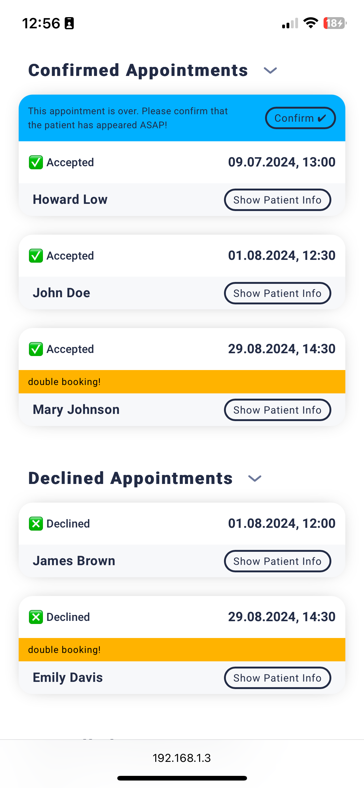

# Doctor Appointments App

[in progress]

🔗 [Deployment ](https://doc-appointments.onrender.com/) (can take 1-2 min to spin up)

Disclaimer: This is a dummy app with fake data. None of the doctors are real and do not have any connection to real life persons or institutions.

## Stack

 
 
 
 
 
 
 

## Features

### Patients

Doctor Appointments is a platform where patients can easily search for doctors and book appointments fast without having to go trough the touble of signing up or creating an account. Just open the app, search for doctors, check free appointments and book them. Leave your email for the doctor to respond to your appointment booking and that's it. After the appointment you'll have a review possibility to share your experience with future patients.

### Doctors

Doctors have to sign up for an account where they can fill in their data. Once the account is created, you'll have access to your personal dashboard to view and manage all your past and future appointments. A email notification is send when patients request bookings and there is the option to accept or decline them.

### Email notice

All mails are send to a mail trap inbox, so if you sign up you will not actually receive emails. Also the app is deployed with a free plan and will spin down with inactivity. This means cron jobs will likely not run. Anyways, it works.

<table>
<tbody>
<tr>

<td align="center">

</td>

<td align="center">

</td>

</tr>
</tbody>
</table>

## Preview

<!--# 1. Tabelle  ---------- -->

Doctors can register and get access to their personal dashboard.

<table>
<tbody>
<tr>

<td align="center">

</td>

<td align="center">

</td>

<td align="center">

</td>

</tr>
</tbody>
</table>

<!--# 2. Tabelle  ---------- -->

There are options to edit profile data, visiting hours and app preferences.

<table>
<tbody>
<tr>

<td align="center">

</td>

<td align="center">

</td>

<td align="center">

</td>

</tr>
</tbody>
</table>

<!--# 3. Tabelle  ---------- -->

Avatars can be uploaded with an extra fancy image crop tool and a neatly styled file input element.

<table>
<tbody>
<tr>

<td align="center">

</td>

</tr>
</tbody>
</table>

<!--# 4. Tabelle  ---------- -->

In the dashboard doctors can display and manage their appointments. New requests from patients can be accepted or declined. If there's more than one booking for a time slot there will be a warning.

<table>
<tbody>
<tr>

<td align="center">

</td>

<td align="center">

</td>

<td align="center">

</td>

</tr>
</tbody>
</table>

<!--# 5. Tabelle  ---------- -->

Doctors will receive an email notification if there are new appoitment requests. Patients will also be notified when doctors confirm or decline their appointment requests.

<table>
<tbody>
<tr>

<td align="center">

</td>

<td align="center">

</td>

<td align="center">

</td>

</tr>
</tbody>
</table>

<!--# 6. Tabelle  ---------- -->

Patients can easily find doctors directly in the home page or search for names & filter spacialties. Each doctor has a detail page with info about visiting hours.

<table>
<tbody>
<tr>

<td align="center">

</td>

<td align="center">

</td>

<td align="center">

</td>

</tr>

<tr>

<td align="center">

</td>

<td align="center">

</td>

<td align="center">

</td>

</tr>
</tbody>
</table>

<!--# 7. Tabelle  ---------- -->

To book appointments just pick a day and choose from free time slots. The slots can be displayed in 12h or 24h format. Fill in your contact data, send the request and you're done! You will be notified via email when the doctor confirms your appointment.

<table>
<tbody>
<tr>

<td align="center">

</td>

<td align="center">

</td>

<td align="center">

</td>

<td align="center">

</td>

</tr>
</tbody>
</table>

<!--# 8. Tabelle  ---------- -->

One day after your appointment patients will receive another email with a review link. To rate the doctor appointment or leave a comment, they will find a link in the mail with a verification code.

<table>
<tbody>
<tr>

<td align="center">

</td>

<td align="center">

</td>

<td align="center">

</td>

</tr>
</tbody>
</table>

## Technical Features / Status

(more detailed description of tech features will follow once the app is done)

[✅] doctors can register, login & logout
  [✅] doctors can create AND UPDATE their profile
  [✅] doctors can create AND UPDATE visiting hours
  [✅] patients can search for doctors and their specialties
  [✅] patients can choose a free time slot and reserve it to request an appointment
  [✅] doctors have to accept reserved time slots in order to confirm the appointment
  [✅] patients receive an email to notify them about the outcome of their requested booking after the time slot has been accepted or declined by a doctor
  [✅] if more than one patient reserved the same time slot, other patients will also be notified that the booking was unsuccessful
  [✅] patients who visited a doctor will get an email with a link to rank their experience the day after an appointment
  [✅] deployment
  [✅] style (almost done) ⤵︎
  [✅] half assed media queries
  [❌] dark mode
  [❌] convert svg icons to jsx for dark mode theme

## Todo

[✅] refresh token
  [✅] doctors should be able to confirm the patient showed up before they're allowed to leave a review/rank (also neccessary for review initializing)
  [✅] seperate register & login routes
  [✅] fix logout
  [✅] delete booked time slots
  [✅] ❗️check booked time slots logic for new time format
  [✅] convert getHeaderTemplate to jsx
  [✅] convert date in emails etc.
  [✅] update db with new sample data
  [✅] time slot format selection (12h/24h)
  [✅] automatic token refresh on all authorized request routes (authFetch)
  [✅] global state setting without having to use context (setGlobalState)
  [✅] dynamic api url to test in iOS without manually setting the url
  [❌] link patients/ & rating to doctors
  [❌] archive past appointments (also to count patient number)
  [❌] more feedback for user actions

## planned extra features & tools

  [✅] crop/zoom avatar before upload
  [❌] more tests, also for react
  [❌] autocomplete search with debounce
  [❌] use navigate to remember scroll position
  [❌] b version with luxon instead manual generator function
  [❌] doctors can cancel already confirmed appointment

## Tools used

- docker
- JWT
- jest, supertest
- cloudinary
- react error boundary
- cron job

 <!-- 
  -->
